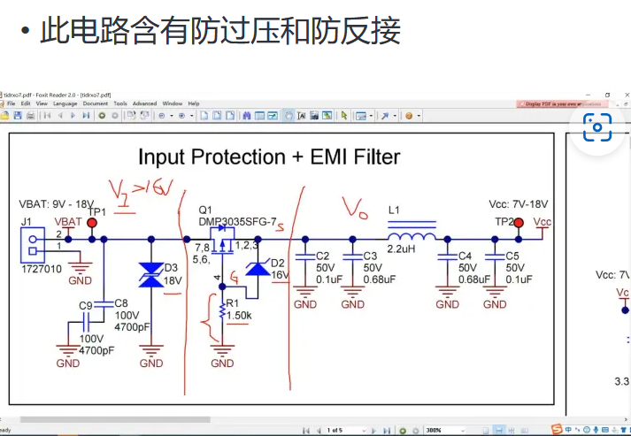
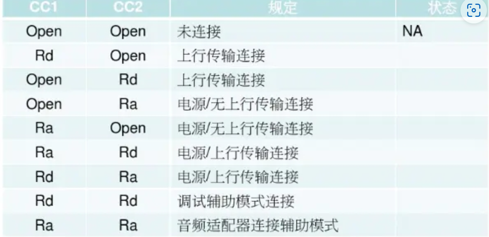

# 蜕壳计划

> 从有刷驱动迈向无刷FOC，最后实现功能级应用，all in one

### 1. 方案与器件选型

LV8827LF集成无刷电机驱动（HAL）

DRV8323HRTAR

MOS：

* HSBB6066（60V 60A）
* AP68N06G（60V 50A）
* STL90N10F7（100V 70A）

电流检测：

* INA381A2IDSGR（采样电阻PA2512FKF7T0R001E）

控制部分：

* MCU： STM32G431CBU6
* 屏幕：中景园0.42寸SSD1335
* 五向开关：SKRHABE010
* 蜂鸣器：MLT-5020

foc控制器开发

